# CG - Facebook Graph API & Messenger SDK Cheatsheet

## Introduction
Documented here are all Messenger SDK & Facebook Graph API Problems that have been encountered in the development of the ChatGenie
Messenger Mini App and covered here are the solutions and references to solve the said problems.

## Table of Contents

- [About User and Page Access Tokens](#about-user-and-page-access-tokens)
- [Invalidated Access Tokens](#invalidated-access-tokens)

- [Existing User Conversation on Launched Mini App](#existing-user-conversation-on-launched-mini-app)
- [FB Page Admin can Access User's Mini App Through Facebook Business Manager](#access-mini-app-on-business-manager)
- [Merchant was removed as FB Page Admin OR Merchant removed permissions on Login](#merchant-invalid-permissions)

- [Page cannot set Messenger Profile (Get Started, Greeting, Persistent Menu)](#page-cannot-set-messenger-profile)
- [Invalidated Page Access Token before Launching Mini App](#invalidated-token-on-launch)
- [Unable to Fetch Mini App User Name and Picture](#unable-to-fetch-mini-app-user-name-and-picture)
- [Corrupted Facebook Page & User Profile Picture](#corrupted-facebook-profile-pictures)
- [Facebook Messaging 24 hour Window](#facebook-messaging-24-hour-window)
- [Messenger Webview Requirements](#messenger-webview-requirements)
- [Handling Dynamic PSID for Static Urls e.g Persistent Menu Urls](#handling-dynamic-psid-for-static-urls)
- [Mini App Static Error Pages](#mini-app-static-error-pages)
- [Manual Client Request Snippets](#manual-client-request-snippets)

## About User and Page Access Tokens
We are using two kinds of facebook token for executing Facebook Graph API Calls in ChatGenie, The `User Access Token` and `Page Access Tokens`. The `User Access Token` is acquired upon Omniauth or Facebook Login.

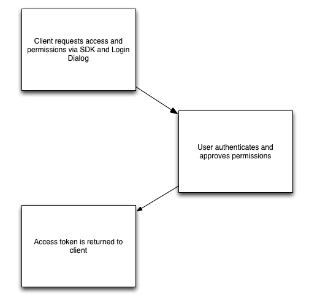

Upon Acquiring the `User Access Token` (Stored in our Database as `Provider` referenced to the `User` Table). We can now acquire `Page Access Tokens` for the allowed pages that the user has selected upon Facebook Login.

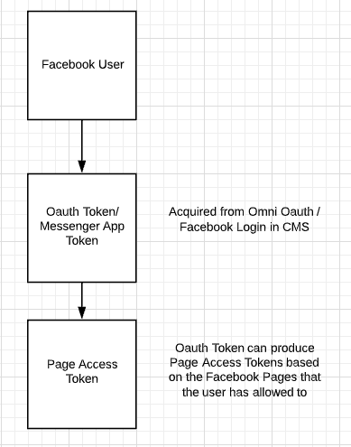

We are using `User Access Tokens` for:
- Fetching User's Facebook Pages
- Generate Facebook Page Access Token
- Fetching User Data

We are using `Page Access Tokens` for:
- Webhooks
- Facebook Page Messaging & Postback
- Sending Messages, Receipts and Messenger Notifications
- Messenger SDK Features

---
---

## Invalidated Access Tokens

We are requesting for a [Long Lived User Access Token](https://developers.facebook.com/docs/facebook-login/access-tokens/#termtokens) but still access tokens are vulnerable for invalidation upon violation of Facebook Policies e.g
- Change of Merchant's FB Password
- Security Issue raised by Facebook e.g unidentified login from a device
- Session Malicious Activity


Once the `User Access Token` is invalidated, all `Page Access Tokens` generated from that user access token will also be invalidated and wont be capable for executing Facebook Graph API Calls thus making the tokens unusable

### Current Solution:
Once access tokens are invalidated, the only way for the system to know that its already invalidated is to catch a failing API Call using the access token

- Add Catch on Get Started to catch Authentication Error for Invalidated Token
- Add JS Ajax call to validate fb page token on Mini App Entry points by adding
```ruby
= javascript_include_tag 'validate_fb_page_token'
```

Everytime a user opts in with a certain Mini App, The Page Access Token is checked if it is still valid. Once the page access token is recognized to be `Invalid`, We will mark the `User/Owner` and the `Page` as `invalidated` and we will require and send the User a notification to relogin to our CMS so that we can acquire a new `User Access Token` and generate new `Page Access Tokens`. We already created an automated process to refresh access tokens for user and page that has been marked as invalidated.

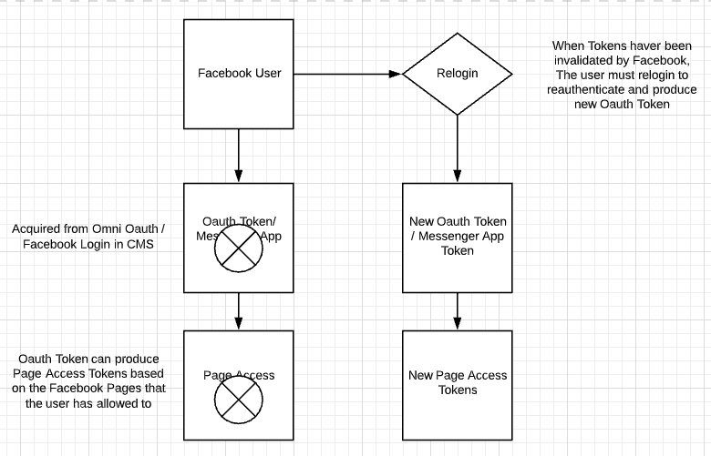

---
---

## Existing User Conversation On Launched Mini App

Most Onboarded Clients have already have existing conversations with their user and most likely users will innteract with the Mini App without having to see and click the `Get Started Page`. There are two scenarios that we needed to cover for this

### Scenario 1 (User has existing convo and no allowed permissions. Last Message between a week - 3 months Ago)

Solution

```ruby
= javascript_include_tag "ask_permission_sdk"
```
On Mini App Entry Points e.g (E-commerce Category Products Page) to countercheck if User has allowed necessary permissions needed. The Permissions that we acquire from `Optin / Get Started` are the following:

- User messaging (For us to send automated messages and replies)
- User Info (For Name and Profile Picture Data Fetching)

We will force the user to enable this permissions (For this permissions are required for the proper functionality of the Mini App to the User)

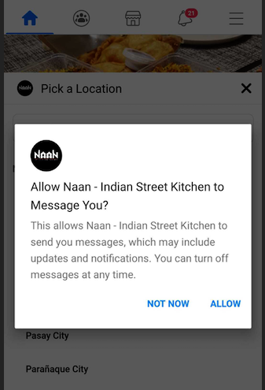

Refs: https://developers.facebook.com/docs/messenger-platform/reference/messenger-extensions-sdk/askPermission

### Scenario 2 (User has existing convo and last message was between 4 months - X Years Ago)

Messenger Extension getContext() will fail to supply a PSID (Sender ID) if User's last page interaction is between 4 months - X Years causing a null sender id to be passed in our API Calls.

```javascript
### messenger_extension_sdk.js.erb

MessengerExtensions.getContext('<%= ENV.fetch("FB_APP_ID") %>',
    function success(thread_context) {
      var psid = thread_context.psid
      /// PSID Will be null

      ...
    },
function error(err) {
  console.log(err);
}
```

Only way for SDK to fetch the User's PSID is for the User to interact (Via messaging the page or deleting the Conversation to Optin Again with The Get Started Page) with the Facebook Page.

Solution:

```ruby
= render "shared/sender_id_error_page",
               page_id: @page_id,
               err_msg: "Send any message or text to the conversation to refresh the page."
```

Add Checking if sender_id is present on Mini App Entry Point. Once we received a null sender_id we will render a static page informing the user to message the page so that we can fetch their PSID via Messenger Extensions SDK.


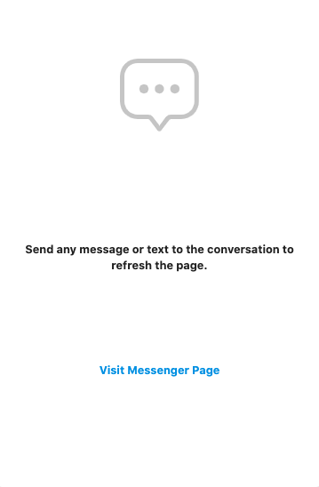

Refs: https://developers.facebook.com/docs/messenger-platform/reference/messenger-extensions-sdk/getContext

---
---

## Access Mini App On Business Manager

Merchant/Page Owners have the capability to open their user's conversation with their pages. Thus allowing them to interact with the Mini App Using a User's Conversation

Solution

```ruby
= javascript_include_tag 'validate_psid'
```
Add Counterchecking if parameter sender_id (Supplied from Conversation Post-back Button) is the same with the fetched PSID from Messenger Extension getContext() to block access to the Mini App from the Business Manager

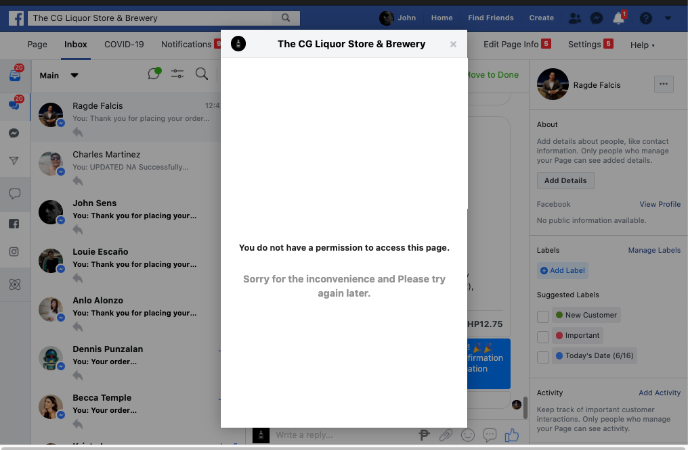

Refs: https://developers.facebook.com/docs/messenger-platform/reference/messenger-extensions-sdk/getContext

---
---

## Merchant Invalid Permissions

Invalid Merchant Permissions will cause the `Messenger Extensions SDK` Initialization to fail. Instances that causes invalid permissions are the following:

- Merchant removed or alter permissions allowed on Facebook Login (Users are allowed to edit the permission and settings they allow upon Login)
- Merchant was removed as Page Admin or was downgraded to `Editor` for the Facebook Page

Solution

Once the Messenger Extension SDK has failed to initialized we render a static page informing that there has been a problem and the merchant should bo contacted immediately to fix the permissions allowed for ChatGenie Messenger App since we cannot automate this process and the User are the only one allowed to edit their allowed permissions.

```javascript
MessengerExtensions.getContext('<%= ENV.fetch("FB_APP_ID") %>',
  function success(thread_context) {
    // success
    ...
  },
  function error(err) {
    console.log(err);
    var redirectUrl = '<%= ENV.fetch("CHATBOT_URL") %>'

    redirectUrl += "/missing_fb_permissions"
    Turbolinks.visit(redirectUrl)
  }
);

```
Add Catch on Messenger Extensions Initialization. Error Code received is `2018164`
Lacking Permissions either from Login or from Page Role will cause for the Mini App not to initialize the Messenger SDK

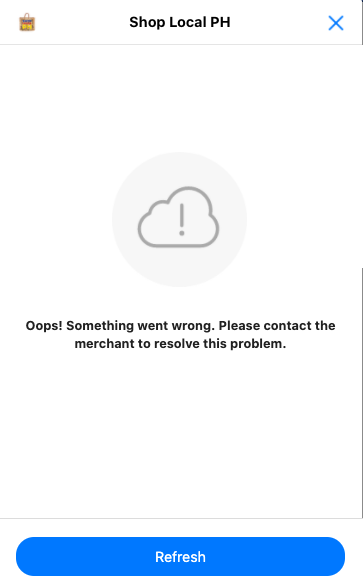

Refs: https://developers.facebook.com/docs/messenger-platform/webview/extensions

---
---

## Page cannot set Messenger Profile

Once we fail to set these Mesesnger Profiles (via Facebook Graph API)

- Get Started
- Greeting Message
- Persistent Menu

This is more of a Permission issue that the user's allow for ChatGenie Messenger App upon login e.g to be specific the `manage_pages` permission. Also most of the time they wouldnt be able to connect or launch their Mini App if they have provided lacking permissions thus blocking as to execute Facebook Graph API Calls intended to Change the Facebook Page

Also one scenario is we failed to set the
- Get Started
- Persistent Menu

But was able to set the `Greeting Message`, High probability that this is more of a `Facebook Role` issue (based on observation and experience). We recommend that Users setting up their Mini App should be an `Admin` of the Facebook Page to be connected to.

---
---

## Invalidated Token on Launch

There are instances that the user will first setup their Mini App then will `Launch` it after several days. Due to facebook policies the User may encounter invalidation of their token before they can `Launch` their Mini App

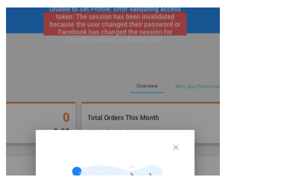

Solution:

Currently we havent automated this process since this scenario doesnt occur that much. To solve we manually mark the user's token as invalidated (Manually execute on server console)

```
$ user.mark_oauth_token_as_invalid!
```

This will mark the user's oauth token and all referencd `page access tokens` to be invalid. Once we mark the access tokens as invalid. We now let the user `Re login in our CMS` and this will automatically refresh their access tokens

---
---

## Unable to Fetch Mini App User Name and Picture

There are instances that we cannot fetch the user profile (Name & Profile Picture) even if they allowed to after interacting with our Mini App. The reasons are:

- Facebook Account is Deactivated
- Facebook Profile Settings Preventing to fetch Messenger Profile

Thus leaving as with a `PageRecipient` data only having a PSID/Sender ID

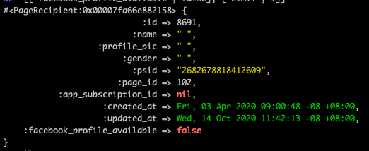

Solution:

To solve the problem, We added a new field to identify users that we failed to fetched their facebook profile. And we update their data once either

- On their first transaction (e.g Order), We update their name record with the name they have added for their Order

- Once we fetched their name and profile picture via Messenger Profile API

---
---

## Corrupted Facebook Profile Pictures

Profile Picutres fetched for `Page` and `User` may be corrupted due to expiration and invalidation. Currently we automated the process to refetch new profile pictures links within a 2 month time range

- User everytime they relogin in the CMS
- Mini App Users everytime they interact with the Mini App

Incase you need to update the profile pictures manually, you can do so by executing it manually in the server console

```ruby
### For Page Profile Picture

$ user.refresh_active_pages_photo_urls
# Will update active pages profile pictures that havent been updated within a 2 month range

### For Page Recipient / Mini App Users

$ page = page_recipient.page
$ graph = Koala::Facebook::API.new(page.access_token)
$ user = graph.get_object(psid)
$ recipient = OpenStruct.new(user)
$ page_recipient.update(profile_pic: recipient.profile_pic)
```

---
---

## Facebook Messaging 24 hour Window

As per [Messenger Platform Policy]("https://developers.facebook.com/docs/messenger-platform/policy/policy-overview/)

`
Businesses will have up to 24 hours to respond to a user. Messages sent within the 24 hour window may contain promotional content. We know people expect businesses to respond quickly, and businesses that respond to users in a timely manner achieve better outcomes. We highly encourage businesses to respond to people’s messages as soon as possible.
`

Meaning we are allowed to send messages everytime a user interacts (Message or React) in the Facebook Page. 1 interaction = 1 allowed automated reply or facebook message.

For us to integrate facebook messenger notifications for our User's Transactions e.g Order Status Updates and Post Order Notifications, We are utilizing the use of [Message Tags]("https://developers.facebook.com/docs/messenger-platform/send-messages/message-tags) specifically the `POST_PURCHASE_UPDATE` message tag to allow us to send Order Related Notifications to our Users

---
---

## Messenger Webview Requirements

Two Common issues encountered when intiailizing the Facebook Webview is

- X Frame Options for Messenger Desktop
- Whitelisted Domain (Currently Automated we whitelist the ChatGenie Mini App Domain upon page connecction on CMS)

To solve iframe issues we need to allow facebook messenger to load our application in an iFrame

```ruby
def allow_facebook_iframe
  response.headers["X-Frame-Options"] = "ALLOW-FROM www.facebook.com"
end
```

Ensure that your controller action entry point will execute the `allow_facebook_iframe` method to ensure that our application will be loaded properly in facebook's iFrame

For Closing the Webview Programatically we already have a dedicated route to close the webview in the Mini App.

Refs: https://developers.facebook.com/docs/messenger-platform/webview

---
---

## Handling Dynamic PSID for Static Urls

We are utilizing the Messenger Extensions SDK Feature `getContext` to dynamically fetch a user's PSID and insert it in our url parameters. We handle this by identifying urls that came from static urls e.g from Persistent Menus

```javascript
window.extAsyncInit = function() {
  MessengerExtensions.getSupportedFeatures(function success(result) {
    var features = result.supported_features;
    if (features.includes("context")) {
      MessengerExtensions.getContext('<%= ENV.fetch("FB_APP_ID") %>',
        function success(thread_context) {
          var psid = thread_context.psid

          # Identify if url has `from_persistent_menu` paramter
          if (window.location.href.includes("from_persistent_menu=true")) {
            var additionalParams = "&messenger_sdk=true&sender_id=".concat(psid);
            additionalParams += "&after_persistent_menu_load=true"
            var url = window.location.href.replace('from_persistent_menu=true','')
            var updatedUrl = url + additionalParams
            Turbolinks.visit(updatedUrl, { action: "replace" } )
          }
        },
        function error(err) {
          ...
        }
      );
    }
  }, function error(err) {
      ...
  });
};
```

Just add the url paramater `from_persistent_menu=true` to enable dynamic PSID fetching to your Mini App URL Route. Upon Messenger Extensions SDK initialization we will update the URL route to add a sender_id paramter having the value of PSID fetched from Messenger SDK.

---
---
## Mini App Static Error Pages

### Facebook Page Related
Everytime a Mini App Loads we countercheck the following
- If the page is Active (Subscribed in CMS) && has a valid access token
- If the mini app is in Maintenance Mode
- If the mini app owner has allowed necessary permissions (Messenger SDK will fail see [here](#merchant-invalid-permissions))
- If mini app has unpaid billings

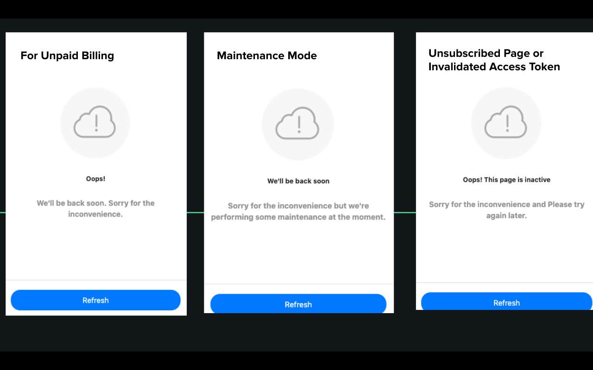
---
### GraphQL Api Connection
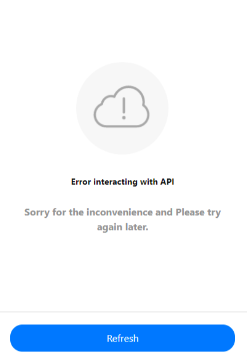
---
### HTTP Error
Error Code is rendered commonly encountered
- 500 -> Code Base Error
- 404 -> Page not Found

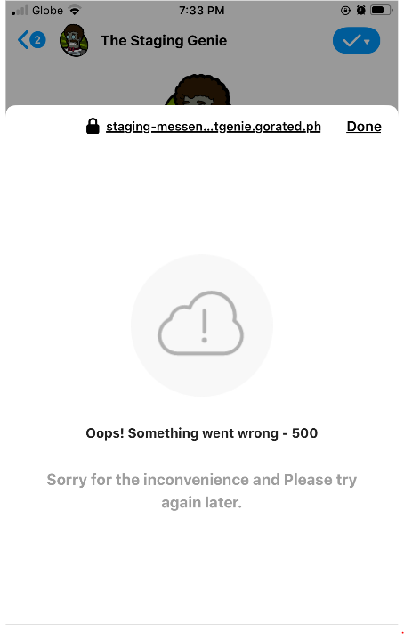

---
---

## Manual Client Request Snippets

### Waiving Convenience Fee

```ruby
app.update(shoulder_convenience_fee: true)
```
---

### Custom Convenience Fee for Merchant

```ruby
app.update(convenience_fee: CONVENIENCE_FEE_AMOUNT_IN_FLOAT)
```
---
### Upgrade Merchant to Enterprise

```ruby
plans = EnterprisePlan.all

enterprise_plan = SELECT FROM EXISTING PLANS
# There are existing plans from bronze to mythical

app.app_enterprise_plans.create(enterprise_plan: enterprise_plan)

# Waive Convenience Fee
app.update(shoulder_convenience_fee: true)

# Remove Powered By ChatGenie on Persistent Menu

app.persistent_menus.where(url: "https://chatgenie.ph").first.destroy

# Unset Persistent Menu via Facebook Graph API
# Any Changes you need to do for a Facebook Page's Persistent Menu
# You need to `Unset` then `Set` via Facebook API

page = app.active_page
Facebook::Messenger::Profile.unset(
  { fields: %w[persistent_menu] },
  access_token: page.access_token
)

# Set Persistent Menu via Facebook Graph API

persistent_menu_payload = app.build_persistent_menu_payload
Facebook::Messenger::Profile.set(
  persistent_menu_payload, access_token: page.access_token
)
```
---
### Changing an Ecommerce App to Super Mini App
Let the merchant create an Ecommerce Mini App and let them finish the DIY Process. After they finished the DIY Process run the following. Then let them `Launch` their app in the CMS


```ruby
mall = App.find_by(name: MALL_NAME)
mall.update(service_bundle: ServiceBundle.last) # Pass Mall Stores Management Service Bundle
mall.blocks.welcome.destroy_all # destroy welcome block
mall.persistent_menus.destroy_all # destroy persistent_menus

### Generate Ecommerce Welcome Block
generate_block = Actions::Blocks::Ecommerce::GenerateWelcomeMessage.execute(
  app: mall, welcome_message: "test"
)
create_block = Actions::Blocks::CreateWelcomeMessageBlock.execute(
  app: mall, welcome_message: generate_block.welcome_message,
  welcome_button: generate_block.welcome_button
)

### Generate Notifications (If none) - Optional
Actions::MiniAppNotification::DefaultNotification.execute(
  app: mall
)

### Create Persistent Menu for Ecommerce
mall.active_page.set_ecommerce_persistent_menu
```
---
### Creating an Inquiry Bundle Mini App
Let the User Create an Ecommerce Mini App. After they created their Mini App run the following. Then let them `Launch` their app in the CMS.

```ruby
page = Page.find_by(name: "Page Name (Replace Accordingly")
page.page_settings.destroy!
ecommerce_app = page.app
user = page.user

service_bundle = ServiceBundle.find_by(name: "Inquiry Bundle")
existing_inquiry_app = service_bundle.apps.where.not(launched_at: nil).first

new_app = App.create(
  name: "New App Name (Replace accordingly)",
  service_bundle: existing_inquiry_app.service_bundle,
  user: user
)
page.update(app: new_app) # Associate Page to new App
ecommerce_app.destroy! # Destroy Dummy Ecommerce App

# Create App Request
new_app.create_requesst(
  details: "New App Request (Replace Accordingly)",
  status: "approved"
)

# Create Persistent Menu
existing_inquiry_app.persistent_menus.each do |menu|
  dup_menu = menu.dup
  dup_menu.url = dup_menu.url.gsub(
    existing_inquiry_app.active_page.fb_page_id,
    new_app.active_page.fb_page_id
  )
  dup.save
end

# Create Welcome BLock
dup_block = existing_inquiry_app.blocks.welcome.first.dup
dup_block.app = new_app
dup_block.save

dup_card = existing_inquiry_app.blocks.welcome.first.cards.first.dup
dup_card.block = dup_block
dup_card.save

dup_button = existing_inquiry_app.blocks.welcome.first.cards.first.buttons.first.dup
dup_button.card = dup_card
dup_button.save
```

### Mark Billing as Paid

```ruby
app.billings.map(&:paid!) # if paid all
# or
app.billings.payment_submitted.map(&:paid!)
# target only submitted payments
```


## Contributing

Updates on this Cheatsheet are welcome. This documentation is intended to be a safe, welcoming space for collaboration, and contributors are expected to adhere to the Contributor Covenant code of conduct.